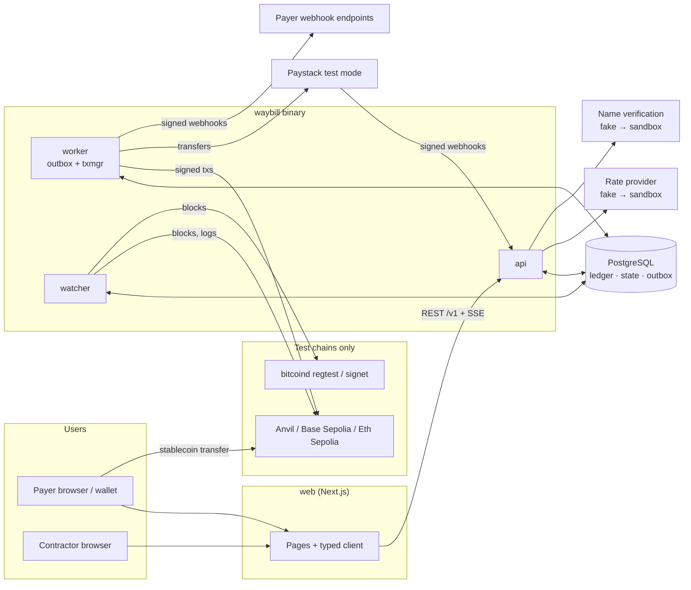
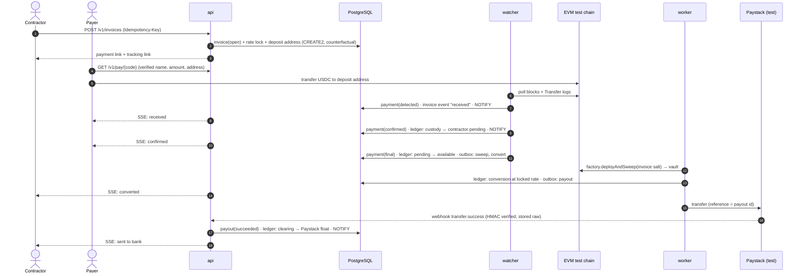

# Waybill — Architecture

This document describes the system as designed. Sections marked *(planned, stage N)* describe parts that do not exist yet; the README status table says what is built.

## 1. Components

| Component | Where | Responsibility |
|---|---|---|
| **API** (`waybill api`) | `api/cmd/waybill`, `api/internal/httpapi` | REST under `/v1`, defined in `openapi/waybill.yaml`. Idempotent creation endpoints. Server-Sent Events for tracking. Writes state changes and outbox rows in one transaction. |
| **Worker** (`waybill worker`) | `api/internal/outbox` *(planned, stage 1)* | Leases outbox rows with `FOR UPDATE SKIP LOCKED` and runs handlers: sweeps, payouts, webhooks, conversions. At-least-once execution with idempotent handlers. |
| **Chain watcher** (`waybill watcher`) | `api/internal/watcher` *(planned, stage 1)* | Follows each configured chain block by block. Detects deposits, tracks detected, confirmed and final, and detects reorgs by block hash. |
| **Transaction manager** | `api/internal/txmgr` *(planned, stage 2)* | The only writer for each signing key. Assigns nonces, estimates and bumps EIP-1559 fees, and records every hash a payment has had. Runs inside the worker. |
| **Ledger** | `api/internal/ledger` *(planned, stage 1)* | Double-entry, append-only, multi-asset. Balance is enforced by PostgreSQL. |
| **State machines** | `api/internal/statemachine` *(planned, stage 1)* | Pure transition functions for invoices and payouts. No I/O. |
| **Test-money guard** | `api/internal/safety` | Refuses to start on a non-test chain or a live provider key. Runs before any subcommand touches a network. |
| **Contracts** | `contracts/` | Deposit forwarder clones (CREATE2), vault, batch payout, mock 6-decimal stablecoin. |
| **Web** | `web/` | Next.js App Router. Tracking page, payment link, contractor and payer apps. Typed against the OpenAPI contract. |
| **PostgreSQL** | `deploy/compose.yaml` | The only source of truth: ledger, state, outbox, idempotency keys, chain view, webhook logs. |
| **Anvil** | `deploy/compose.yaml` | Local EVM dev chain (31337). The "pull the plug" demo forces reorgs here. |
| **Providers** | external, sandbox only | Paystack test mode (pay-in, payout). Identity verification and exchange rates behind interfaces, with fakes first. |

One Go binary carries every server-side role as a subcommand (`api`, `worker`, `watcher`, `migrate`, `healthcheck`). They share packages, but each role runs as its own process.

## 2. System diagram



## 3. A payment's life, from link to bank



## 4. Data model

All amounts use the `minor_units` domain: whole **minor units** of a named asset with a fixed scale, up to 78 digits (any `uint256`). The domain is unconstrained `numeric` with `CHECK (scale(VALUE) = 0)`, because `numeric(78,0)` would silently round `1.5` to `2` (ADR-028). Go code uses `money.Amount` (an immutable `big.Int` wrapper), never `float64`. The ledger tables are specified in [design/ledger.md](design/ledger.md).

| Table | Key columns | Notes |
|---|---|---|
| `assets` | `code` PK, `scale` | `USDC`/6, `USDT`/6, `NGN`/2, `BTC`/8, `ETH`/18. |
| `chain_assets` | `network`, `contract_address`, `asset_code` | Maps a token on a network to a ledger asset. |
| `ledger_accounts` | `id`, `code` unique, `asset_code`, `kind`, `balance_rule` | Immutable. For example `liability:contractor:{id}:USDC:available`, `custody:deposit:evm_84532:USDC`. `balance_rule` ∈ `non_negative`, `non_positive`, `any`. |
| `journal_entries` | `id`, `idempotency_key` unique, `kind`, `ref_type`, `ref_id`, `reverses_entry_id` unique, `xact_id` | Append-only. A reversal points at what it reverses and must mirror it exactly. |
| `ledger_balances` | `account_id`, `balance_rule`, `balance` | Cache of the sum of postings, maintained only by triggers. `CHECK ledger_balance_rule` makes overdrafts impossible. |
| `postings` | `id`, `entry_id`, `account_id`, `asset_code`, `amount` (signed) | Append-only. A deferred constraint trigger checks that the sum per `(entry_id, asset_code)` is 0 at commit. |
| `contractors`, `payer_orgs`, `org_members` | | Identity and verification status. Bank details are stored with the verified name. |
| `invoices` | `id`, `tracking_code` unique, `state`, `amount`, `asset_code`, `payout_mode`, `rate_quote_id`, `expires_at` | `state` changes only through the state machine. |
| `invoice_events` | `id` bigserial, `invoice_id`, `type`, `data`, `created_at` | Feeds the tracking page and SSE replay (`Last-Event-ID`). |
| `rate_quotes` | `id`, `pair`, `rate_num`, `rate_den`, `fee`, `expires_at`, `source` | A rate is a ratio of integers, never a decimal float. |
| `deposit_addresses` | `network`, `address`, `invoice_id`, `salt` | Counterfactual CREATE2 address per invoice and network. |
| `chain_blocks` | `network`, `height`, `hash`, `parent_hash` | The watcher's view of the canonical chain, used for reorg detection. |
| `payments` | `id`, `network`, `tx_hash`, `log_index`, `block_hash`, `amount`, `state` | Unique on `(network, tx_hash, log_index)`, so duplicate sightings are no-ops. |
| `payouts` | `id`, `state`, `rail` (`paystack`, `evm`), `amount`, `provider_ref` | `provider_ref` = our payout id, so the provider deduplicates too. |
| `outbound_txs` | `id`, `signer`, `network`, `nonce`, `purpose`, `ref_id`, `state` | One row per logical transaction. Unique on `(signer, network, nonce)`. |
| `outbound_tx_attempts` | `outbound_tx_id`, `hash`, `max_fee`, `tip`, `broadcast_at` | Every hash ever broadcast for a transaction. Rows are never deleted. |
| `signer_nonces` | `signer`, `network`, `next_nonce`, `lease_owner`, `lease_expires_at` | One writer per key, enforced by lease. |
| `idempotency_keys` | `principal`, `key`, `request_hash`, `status`, `response`, `created_at` | Unique on `(principal, key)`. |
| `outbox` | `id`, `topic`, `payload`, `available_at`, `attempts`, `lease_owner`, `lease_expires_at`, `done_at`, `last_error` | Leased with `FOR UPDATE SKIP LOCKED`. |
| `provider_events` | `provider`, `event_id`, `raw_body`, `signature`, `received_at`, `processed_at` | Unique on `(provider, event_id)`. Raw bytes are kept for audit. |
| `webhook_endpoints`, `webhook_deliveries` | | Outgoing webhook configuration and the delivery log (each attempt, status and latency). |
| `approvals` | `batch_id`, `approver_id`, `decision` | `CHECK` approver ≠ creator, enforced in SQL as well as in code. |

Migrations live in `api/db/migrations` (goose) and queries in `api/db/queries` (sqlc). Changing the ledger tables requires a decision record and approval.

### Ledger conventions

- Signed amounts: debit is positive, credit is negative. Every entry sums to zero **per asset**.
- A conversion is one entry with postings in two assets, each balancing separately through an `fx:position:{asset}` account.
- A contractor's balance has two parts: `liability:contractor:{id}:{asset}:pending` (confirmed, not final) and `...:available` (final). Payouts draw only from `available`.
- A correction is a new entry with `reverses_entry_id` set. Nothing is updated or deleted.

## 5. State machines

Both live in `api/internal/statemachine`. Each is a pure function: `Transition(state, event) (State, []Effect, error)`. Effects are data (for example "post ledger entry X" or "enqueue payout") that the caller carries out in the same database transaction.

### 5.1 Invoice

Implemented in `api/internal/statemachine/invoice.go` (`InvoiceTransition`).

```mermaid
stateDiagram-v2
  [*] --> open
  open --> received: PaymentDetected
  open --> expired: Expire
  open --> cancelled: Cancel
  received --> received: PaymentDetected (another payment)
  received --> confirmed: ConfirmedExact
  received --> underpaid: ConfirmedShort
  received --> overpaid: ConfirmedOver
  underpaid --> received: PaymentDetected (top-up)
  underpaid --> confirmed: UnderpaymentAccepted
  confirmed --> settled: PaymentFinal
  overpaid --> settled: PaymentFinal
  expired --> received: PaymentDetected (late; rate re-quoted)
  received --> open: PaymentReorged
  underpaid --> open: PaymentReorged
  confirmed --> open: PaymentReorged
  overpaid --> open: PaymentReorged
  settled --> [*]
  cancelled --> [*]
```

- **Confirmation is classified, not interpreted.** `ClassifyConfirmation(confirmedTotal, due)` picks `ConfirmedExact`, `ConfirmedShort` or `ConfirmedOver`, so the machine itself never does arithmetic.
- **A reorg always returns to `open`.** The watcher then rescans and replays detection and confirmation events for the payments that are still on the canonical chain. The invoice re-derives its state from what is actually there, instead of the machine guessing which payment vanished. If the invoice was past its expiry, `Expire` is applied again after the replay.
- **A reorg after `settled` is illegal.** It would mean finality was violated, so it returns `ErrIllegalTransition`, which the caller raises as an alert. Every pair not in the diagram is illegal in the same way.

`settled` means the funds are final and credited to the contractor. What happens next (conversion, payout) belongs to the payout state machine. The tracking page combines both machines into four steps:

| Tracking step | Driven by |
|---|---|
| Received | invoice ∈ {received, underpaid, overpaid, confirmed, settled} |
| Confirmed | invoice ∈ {confirmed, overpaid, settled} |
| Converted | payout ≥ `converted` (or "kept as stablecoin") |
| Sent to bank | payout = `succeeded` |

### 5.2 Payout (hand-written by the project owner)

The design note, signatures and failing tests are provided. The implementation is written by hand (see [CLAUDE.md](../CLAUDE.md)).

| From | Event | To |
|---|---|---|
| `queued` | `Converted` | `converted` |
| `queued` | `HoldRequested` | `held` (contractor keeps stablecoin) |
| `converted` | `Submit` | `submitting` |
| `submitting` | `ProviderAccepted` | `submitted` |
| `submitting` | `ProviderRejected` | `failed` |
| `submitting` | `ProviderUnknown` (timeout, 5xx) | `unknown` |
| `unknown` | `ReconciledAccepted` | `submitted` |
| `unknown` | `ReconciledNotFound` | `converted` (safe to resubmit with the same reference) |
| `submitted` | `ProviderSucceeded` | `succeeded` |
| `submitted` | `ProviderFailed` | `failed` |
| `succeeded` | `ProviderReversed` | `reversed` |
| `failed` | `RetryApproved` | `converted` |
| `queued`, `converted` | `Cancel` | `cancelled` |

Every pair not listed is illegal and returns `ErrIllegalTransition`. The test table enumerates every `(state, event)` pair.

## 6. Invariants

Each invariant names the test that proves it. A test that does not exist yet carries the stage it lands in.

| # | Invariant | Enforced by | Proving test |
|---|---|---|---|
| I1 | **Test money only.** Services refuse to start on a non-allowlisted chain, an RPC whose live chain ID differs from config, or a non-test provider key. | `internal/safety.Check` at startup of every subcommand | `TestCheck_*` in `api/internal/safety/guard_test.go` *(stage 0, exists)* |
| I2 | **Money is integers.** No float type is used for amounts. | `money.Amount`; `minor_units` domain rejecting fractional scale; an AST test forbidding float identifiers in `money`, `ledger`, `statemachine` | `TestNoFloatsInMoneyPackages` (AST scan), `rapid` properties `TestAmount_ArithmeticRoundTrip`, `TestDecimal_FormatParseRoundTrip`, `TestNumeric_RoundTrip` in `api/internal/money` *(exist)* |
| I3 | **Entries balance per asset**, enforced by the database. | Deferred constraint trigger on `postings` | `TestLedger_UnbalancedEntryRejectedByDB`, `TestLedger_BalanceIsPerAsset` (raw SQL bypassing Go) *(exist, branch `stage1/ledger-engine`)* |
| I4 | **Ledger is append-only.** | Trigger rejects `UPDATE`/`DELETE` on `journal_entries` and `postings`; app role lacks those grants | `TestLedger_UpdateAndDeleteRejected`, `TestLedger_CannotAddPostingsToCommittedEntry`, `TestLedger_BalanceCacheCannotBeWrittenDirectly` *(exist, branch)*; separate app role without UPDATE/DELETE grants *(stage 1)* |
| I5 | **Any sequence of postings keeps every entry balanced and the trial balance at zero.** | Posting engine | `rapid` property `TestLedger_TrialBalanceAlwaysZero` *(exists, passes)* |
| I6 | **Money-moving requests are idempotent.** Same key and same body give the same response; same key and a different body give 422. | `idempotency_keys` written in the same tx as the effect | `TestIdempotency_RetryReturnsOriginal`, `TestIdempotency_KeyReuseDifferentBody`, `TestIdempotency_ConcurrentSameKey` *(stage 1)* |
| I7 | **State machines are total and pure.** | `statemachine` package imports no I/O packages | `TestInvoice_AllPairs` (72 pairs), `TestStatemachine_NoIOImports` in `api/internal/statemachine` *(exist)*; `TestPayout_AllPairs` *(stage 3)* |
| I8 | **A payment is not final when first seen; reorgs reverse.** | Watcher block-hash chain, `payments` states, reversing entries | `TestWatcher_ReorgReversesConfirmedPayment` (Anvil snapshot/revert via testcontainers) *(stage 2)* |
| I9 | **Duplicate sightings are no-ops.** | Unique `(network, tx_hash, log_index)` | `TestWatcher_DuplicateLogIsNoop` *(stage 1)* |
| I10 | **One writer per signing key; no nonce is used twice.** | `signer_nonces` lease; unique `(signer, network, nonce)` | `TestTxMgr_ConcurrentSendersNeverShareNonce` *(stage 2)* |
| I11 | **Stuck transactions are replaced by raising both fees by at least the node's minimum bump; every hash is recorded.** | txmgr fee logic | `TestTxMgr_ReplacementBumpsBothFees` (`rapid`), `TestTxMgr_AllAttemptHashesRecorded` *(stage 2)* |
| I12 | **"Couldn't find out" is distinct from "no".** An RPC or provider error never becomes "not paid" or "not sent". | Tri-state results (`Known(true)`, `Known(false)`, `Unknown(err)`); payout `unknown` state | `TestPayout_ProviderTimeoutGoesUnknownNotFailed`, `TestWatcher_RPCErrorDoesNotAdvance` *(stage 2–3)* |
| I13 | **Outgoing webhooks are signed, retried and logged.** | `t=…,v1=HMAC-SHA256(secret, t.body)` header; backoff; `webhook_deliveries` | `TestWebhook_SignatureVerifies`, `TestWebhook_RetriesWithBackoff` *(stage 2)* |
| I14 | **Incoming webhooks are verified, stored raw and processed once.** | Signature check before parse; unique `(provider, event_id)` | `TestPaystackWebhook_BadSignatureRejected`, `TestPaystackWebhook_ReplayProcessedOnce` *(stage 3)* |
| I15 | **Keys are never logged.** Bitcoin holds only an xpub. | `secret.String` redacts in `String()`/`LogValue()`; `Signer` interface; no private-key config for BTC | `TestSecret_NeverAppearsInLogs` *(stage 1)*; `TestBTCConfig_RejectsPrivateKey` *(stage 5)* |
| I16 | **On-chain payout is at most once per payout id.** | `Vault.payout` records `paid[payoutId]` and reverts on reuse; `BatchPayout` goes through it | `test_RevertWhen_PayoutIdReused`, `testFuzz_DailyTotalNeverExceedsLimit` in `contracts/test/Vault.t.sol` *(exist)*; invariant test `invariant_VaultOutflowEqualsRecordedPayouts` *(stage 2)* |
| I17 | **Approver ≠ creator for runs over threshold.** | SQL `CHECK` plus API check | `TestBatch_SelfApprovalRejected` *(stage 4)* |
| I18 | **Reserves ≥ liabilities.** | Reconciliation job; proof-of-reserves page | `TestReconcile_DetectsShortfall` *(stage 4)* |
| I19 | **The API contract cannot drift.** | Generated Go and TS types; `make lint` fails on uncommitted codegen diff | CI job `codegen` *(stage 0, exists)* |

## 7. Background work: the outbox

- A state change and the work it causes are written in **one transaction**: the domain rows, the ledger entry and an `outbox` row.
- Workers lease rows with `SELECT … FOR UPDATE SKIP LOCKED LIMIT n`, set `lease_owner` and `lease_expires_at`, and commit. A crashed worker's lease expires and another worker picks the row up.
- Handlers are idempotent. Each one checks the target's current state before acting, and external calls carry our id as the provider reference.
- Live updates use `NOTIFY` in the same transaction. The API `LISTEN`s and fans out to SSE clients. A reconnecting client sends `Last-Event-ID` and gets the missed rows from `invoice_events`. No broker is involved.

## 8. Chain watching

- Polls `eth_getBlockByNumber` and `eth_getLogs` for ERC-20 `Transfer` events to known deposit addresses. Polling (rather than subscriptions) survives RPC reconnects and is easy to replay.
- Stores `(height, hash, parent_hash)` per block. If a new block's `parent_hash` does not match the stored hash at `height-1`, the watcher walks back to the common ancestor, marks payments in orphaned blocks `reorged`, posts reversing entries for any that were confirmed, and rescans.
- Per-network policy: `confirmations` for *confirmed*, and the `finalized` block tag (or a fixed depth on Anvil) for *final*.
- An RPC error leaves the cursor where it was. It never marks anything as missing.

## 9. Contracts

| Contract | Purpose | Status |
|---|---|---|
| `MockStablecoin` | 6-decimal ERC-20 for local and testnet work. Anyone may mint, but deployment and minting revert outside chain ids 31337, 84532 and 11155111. | Built |
| `DepositForwarder` | Implementation behind every deposit address. `vault` and `factory` are immutables in its code, so EIP-1167 clones need no initialiser and nothing in a clone's storage can redirect funds. `sweep(token)` moves the full balance to the vault, factory only. | Built |
| `ForwarderFactory` | `predict(salt)` gives the CREATE2 address before deployment, with `salt = keccak256(invoiceId)`. `deployAndSweep(salt, token)` (`SWEEPER_ROLE` only) deploys the clone if needed and sweeps it. Events are emitted before any state-changing external call, and the sweep must move exactly the announced amount (`SweepMismatch`). | Built |
| `Vault` | `AccessControl` roles (`PAYOUT`, `PAUSER`, admin), per-token per-transaction and per-UTC-day limits, `Pausable`. Limits fail closed: a token with no limits cannot be paid out. Only the admin can unpause. `payout(token, to, amount, payoutId)` rejects a reused payout id, so a payout id moves money at most once regardless of the caller (I16). | Built (stage 2 adds invariant tests) |
| `BatchPayout` | Pays N recipients from the vault in one transaction, one event per payout id. | Stage 2 |

Deployment: `contracts/script/Deploy.s.sol` deploys the token, vault and factory and grants the broadcaster every operational role. That is acceptable on test networks only.

## 10. Test-money guard

Runs first in `api`, `worker` and `watcher`.

1. **Configuration check.** Every entry in `WAYBILL_CHAINS` must be on the allowlist `evm:31337`, `evm:84532`, `evm:11155111`, `btc:regtest`, `btc:signet`. `PAYSTACK_SECRET_KEY`, when set, must begin with `sk_test_`.
2. **Live check.** Each EVM RPC is asked for `eth_chainId`. The service refuses to start if the answer differs from the configured chain or if the RPC cannot answer, because not knowing counts as a failure. Networks without a live check yet (Bitcoin, until stage 5) also fail closed.
3. Errors name the network and the RPC **host only**. RPC URLs often contain API keys.

## 11. Failure modes

| Failure | Detection | Handling |
|---|---|---|
| Worker killed mid-job | Lease expires | Another worker re-runs the idempotent handler. Provider calls reuse the same reference. |
| API crash after effect, before response | Client retries with the same idempotency key | The stored response is returned and the effect is not repeated. |
| Chain reorg | Parent-hash mismatch | Walk back, mark orphaned payments, reverse ledger entries, rescan. The tracking page explains it in plain words. |
| RPC down or erroring | Error result | Cursor does not advance. State is `unknown`, never "not paid". Failover to the next RPC *(stage 5)*. |
| Stuck transaction (fee too low) | Not mined after N blocks | Replace at the same nonce with both fees bumped. Record the new hash and watch all hashes. |
| Gas estimation fails | Estimation error | Do not broadcast. Mark the attempt and alert. A revert reason is recorded when available. |
| Underpayment / overpayment | Confirmed amount ≠ due | `underpaid` / `overpaid` states, resolved by the contractor or a top-up. Overpayment is credited and shown on the receipt. |
| Late payment | Payment after `expires_at` | Accepted into `expired → received`. The rate is re-quoted; it is never silently dropped. |
| Duplicate payment sighting | Unique constraint | No-op. |
| Provider timeout on payout | Timeout or 5xx | Payout → `unknown`. The reconciler queries by reference, and the payout is never resubmitted blind. |
| Webhook replay or forgery | Signature and event-id uniqueness | Forged events are rejected. Replays are stored once and processed once. |
| Database unavailable | Health check | The API returns 503. Workers stop leasing. Nothing proceeds without the source of truth. |
| Signing key misuse | Single-writer lease, vault limits, pause | Limits cap the loss and pause stops outflows. See [RISKS.md](RISKS.md). |
